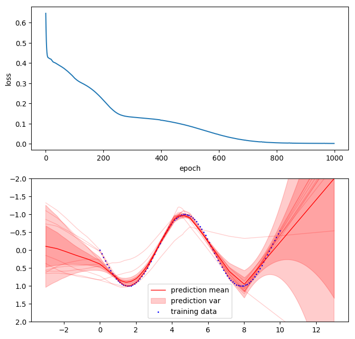
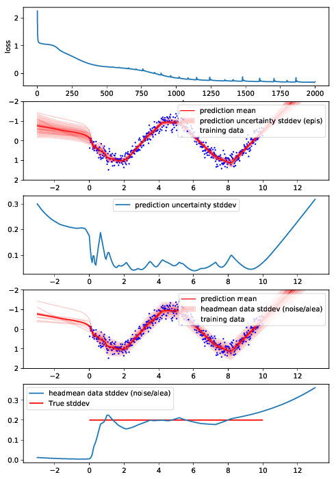
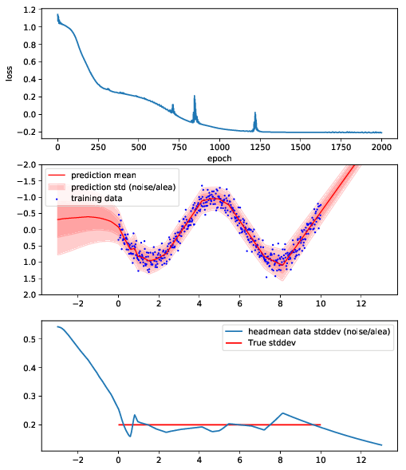

# Bootstrapped Deep Neural Network Implementation in Tensorflow

Implementation of a regression DNN with multiple 'bootstrap heads' for modelling epistemic uncertainty.   
The multiple ensemble networks are combined into a single efficient network with a 'body' of shared variables and several 'heads' with separate variables.
The probability of a head being trained on a training sample is controlled via sampling a binary bootstrap mask.

> Based on "Deep Exploration via Bootstrapped DQN" by Ian Osband et al.   
> http://papers.nips.cc/paper/6500-deep-exploration-via-bootstrapped-dqn

Note: This implementation is regression only, no reinforcement learning parts are included.

`$ python example_bootstrap.py`

## Extended version that also estimates aleatoric uncertainty (data noise) in addition to epistemic uncertainty:

`$ python example_bootstrap_epis_alea.py`

Note: As each head estimates the data noise, the following plot shows the mean reported by all heads.

## Simple dnn that only estimates aleatoric uncertainty (no bootstrap):

`$ python example_dnn_alea.py`

