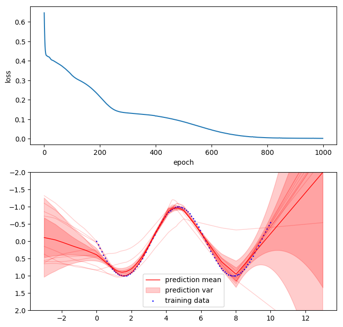

# Bootstrapped Deep Neural Network Implementation in Tensorflow

Implementation of a regression DNN with multiple 'bootstrap heads' for modelling epistemic uncertainty.   
The multiple ensemble networks are combined into a single efficient network with a 'body' of shared variables and several 'heads' with seperate variables.
The probability of a head being trained on a training sample is controlled via sampling a binary bootstrap mask.

Note: This implementation is regression only, no reinforcement learning parts are included.

> Based on "Deep Exploration via Bootstrapped DQN" by Ian Osband et al.
> http://papers.nips.cc/paper/6500-deep-exploration-via-bootstrapped-dqn

`$ python example_bootstrap.py`

